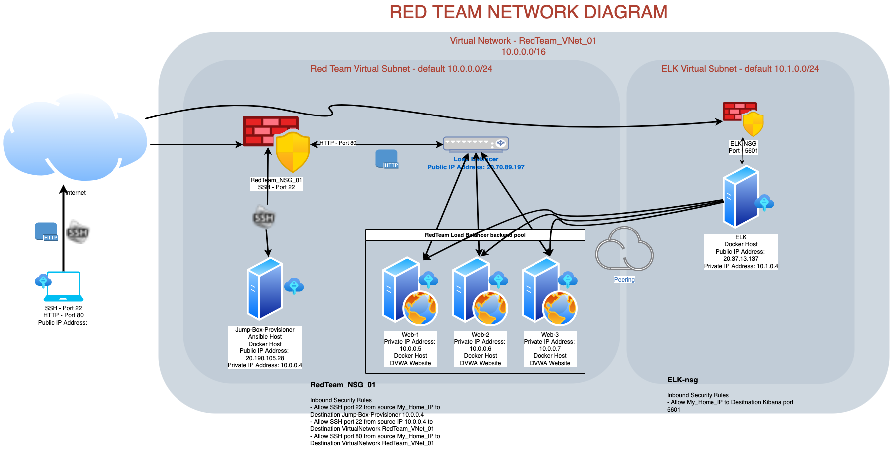
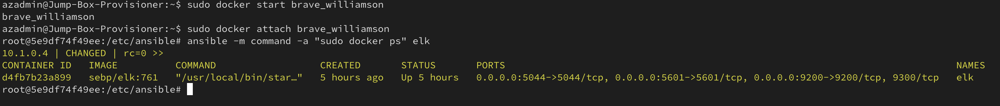

## Automated ELK Stack Deployment

The files in this repository were used to configure the network depicted below.

These files have been tested and used to generate a live ELK deployment on Azure. They can be used to either recreate the entire deployment pictured above. Alternatively, select portions of the playbook file may be used to install only certain pieces of it, such as Filebeat.

  - ELK.yaml
  - filebeat.yaml
  - metricbeat.yaml

This document contains the following details:
- Description of the Topology
- Access Policies
- ELK Configuration
  - Beats in Use
  - Machines Being Monitored
- How to Use the Ansible Build

### Description of the Topology

The main purpose of this network is to expose a load-balanced and monitored instance of DVWA, the D*mn Vulnerable Web Application.

Load balancing ensures that the application will be highly available, in addition to restricting access to the network.
- Load balancing is the process of distributing traffic to multiple servers. A load balancer sits between the client devices and the webservers and ensures that traffic is distributed accordingly (depending on the selected load balancing technique). A load balancer protects the service from Denial of Service by ensuring multiple servers are available to respond to heavy traffic. 
- A Jump box is a Public / Internet facing server that allows access to a network via certain open ports or service (usually port 22 SSH). The advantage of having a jump box is that it is hardened is such a way that there are only limited services running on the machine that can be targetted by attackers. It acts as a single point of entry and audit point for traffic before being able to access the resources within the network.

Integrating an ELK server allows users to easily monitor the vulnerable VMs for changes to the files and system metrics.
- Filebeat is a lightweight agent that monitors and collects data from log files within the system.
- Metricbeat is a lightweight agent that can be installed on servers to periodically collect system metric data like CPU or memory related data.

The configuration details of each machine may be found below.

| Name     | Function | IP Address | Operating System |
|----------|----------|------------|------------------|
| Jump-Box-Provisioner | Gateway  | 10.0.0.4   | Linux (Ubuntu)   |
| Web-1    | WebServer         | 10.0.0.5           | Linux (Ubuntu)                 |
| Web-2    | WebServer         | 10.0.0.6           | Linux (Ubuntu)                 |
| Web-3    | WebServer         | 10.0.0.7           | Linux (Ubuntu)                 |
| ELK    | Monitoring         | 10.1.0.4          | Linux (Ubuntu)                 |

### Access Policies

The machines on the internal network are not exposed to the public Internet. 

Only the Jump box machine can accept connections from the Internet. Access to this machine is only allowed from the following IP addresses:
- 124.170.22.31

Machines within the network can only be accessed by ELK Monitoring.
- 124.170.22.31

A summary of the access policies in place can be found in the table below.

| Name     | Publicly Accessible | Allowed IP Addresses |
|----------|---------------------|----------------------|
| Jump-Box-Provisioner | Yes         | Public IP / 10.0.0.0/16 / 10.1.0.0/16   |
|    Web-1      | No                    | 10.0.0.0/16 10.1.0.0/16                     |
|    Web-2     | No                    | 10.0.0.0/16  10.1.0.0/16                   |
|    Web-3     | No                    | 10.0.0.0/16  10.1.0.0/16                   |
|    ELK    | Yes                    | Public IP / 10.0.0.0/16  10.1.0.0/16                   |

### Elk Configuration

Ansible was used to automate configuration of the ELK machine. No configuration was performed manually, which is advantageous because...
- Automating configuration with ansible allows us to do manual tasks repetitively by writing the steps into the playbook. This is beneficial in configuring multiple servers since it ensures that all servers receive the same configuration. 

The playbook implements the following tasks:
- Update apt cache
- Install docker.io
- Install pip
- Change the max map count to 262144
- Download the sebp/elk container image and publish to ports 5601, 9200 & 5044
- Enable docker service on boot

The following screenshot displays the result of running `docker ps` after successfully configuring the ELK instance.

### Target Machines & Beats
This ELK server is configured to monitor the following machines:
- Web-1 - 10.0.0.5
- Web-2 - 10.0.0.6
- Web-3 - 10.0.0.7

We have installed the following Beats on these machines:
- Metricbeats version 7.6.1
- Filebeats version 7.6.1

These Beats allow us to collect the following information from each machine:
- Filebeat collects information about file system based from system logs. It is helpful in determining changes like apache errors.
- Metricbeat collects information about system metrics like CPU and Memory utilisation. It is helpful in determining performance of the system that is being monitored.a

### Using the Playbook
In order to use the playbook, you will need to have an Ansible control node already configured. Assuming you have such a control node provisioned: 

SSH into the control node and follow the steps below:
- Copy the `elk.yaml` file to `/etc/ansible/` folder on the docker provisioner.
- Update the `/etc/ansible/hosts` file to include the IP address of the ELK VM `10.1.0.4`.
- Run the playbook `elk.yml` by running `ansible-playbook /etc/ansible/elk.yaml`.
- Navigate to `http://ELK_VM_PUBLIC_IP:5601/app/kibana` to check that the installation worked as expected.
- Copy the `filebeat-playbook.yaml` and `metricbeat-playbook.yaml` files to the folder `/etc/ansible/` folder on the docker provisioner.
- Create a new folder `/etc/ansible/files` on the docker provisioner.
- Copy the files `filebeat-config.yaml` and `metricbeat-config.yaml` into the newly created `/etc/ansible/files` folder.
- Run the playbook `filbeat-playbook.yaml` by running the command `ansible-playbook filebeat-playbook.yaml` to install filebeat on the ELK VM and start monitoring the webserver nodes.
- Run the playbook `metricbeat-playbook.yaml` by running the command `ansible-playbook metricbeat-playbook.yaml` to install metricbeat on the ELK VM and start monitoring the webserver nodes.
- Navigate to `http://ELK_VM_PUBLIC_IP:5601/app/kibana` and check to see metricbeat and filebeat entries.

